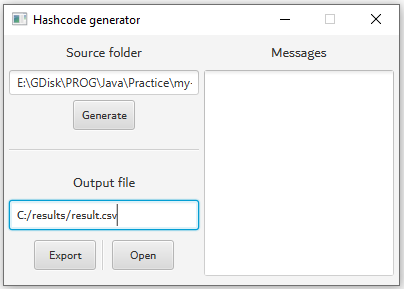
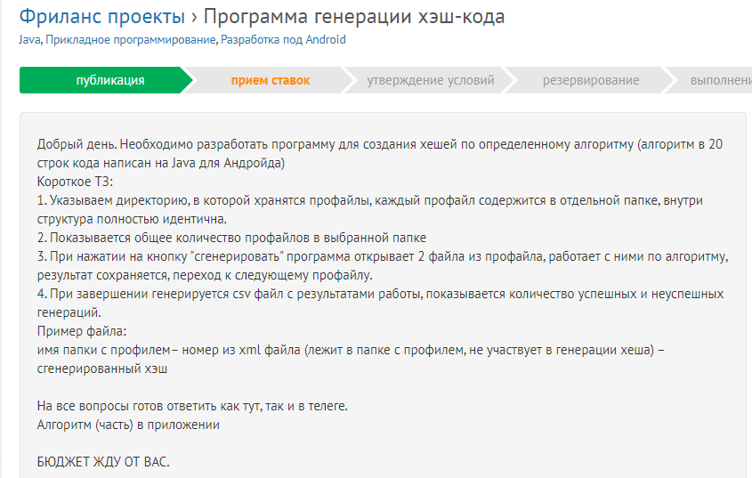

## Program for calculating the hash code of subdirectories based on the files placed in them (1 level of nesting)

     

### Technologies used
* Java 11 (Concurrent, Stream API, IO, NIO);
* JavaFX (GUI);

### Operating algorithm:

* The root directory for which subdirectories are required to determine the hash code is entered as input.

* Then, after clicking the Generate button, the program finds all subdirectories containing files inside (at one level), files of the root directory are ignored. A queue of objects is created. The hash code is generated in multiple threads (depending on the number of processor cores) for each subfolder with files. The result is stored in the queue.

* After obtaining all the results, clicking the Export button writes to a file in csv format (the path and file name are entered in the input field).

* Clicking the Open button opens the file.

* p.s. The program is based on the task below, but the exact task parameters are unknown (algorithm, file structure, profiles):

